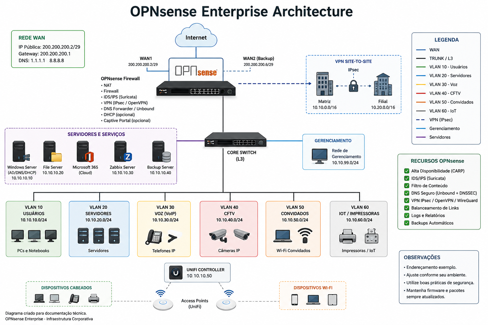

# 🔥 OPNsense Enterprise

> Documentação técnica sobre implantação, administração e boas práticas utilizando o firewall OPNsense em ambientes corporativos.

---

# 📌 Objetivo

Este projeto reúne documentação técnica baseada em boas práticas de infraestrutura corporativa utilizando o OPNsense como firewall principal.

Os conteúdos apresentados são genéricos e destinados a estudos, laboratórios e demonstrações técnicas.

---

# 🏗️ Arquitetura de Referência

---

# 📚 Documentação

| Documento | Descrição |
|-----------|-----------|
| 📐 [Architecture.md](Architecture.md) | Arquitetura da solução |
| 🔐 [VPN.md](VPN.md) | VPN Site-to-Site |
| 🌐 [VLAN.md](VLAN.md) | Segmentação de rede |
| 🛡 [Firewall-Rules.md](Firewall-Rules.md) | Regras de Firewall |
| 💾 [Backup.md](Backup.md) | Estratégia de Backup |
| 📊 [Monitoring.md](Monitoring.md) | Monitoramento |
| ✅ [Best-Practices.md](Best-Practices.md) | Boas práticas |
---

# 🖥 Tecnologias

- OPNsense
- Windows Server
- Active Directory
- Microsoft 365
- OpenVPN
- WireGuard
- VLAN
- UniFi
- Zabbix

---

# 🎯 Objetivos do Projeto

- Segurança
- Alta disponibilidade
- Segmentação
- VPN segura
- Monitoramento
- Documentação

---

# 📖 Licença

MIT License
